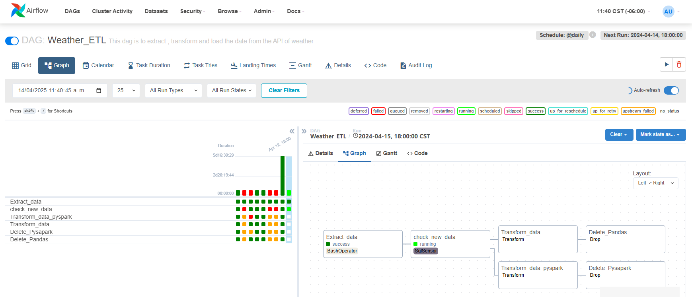

# Weather_Proyect

## Descripcion 
Este repositorio contiene un proyecto de extracción y análisis de datos meteorológicos históricos provenientes de una base de datos climática de EE. UU. El objetivo es explorar tendencias climáticas, detectar anomalías y visualizar patrones relevantes que puedan apoyar investigaciones o aplicaciones en campos como agricultura, energía, planificación urbana y cambio climático.

## Que contiene este proyecto?

- **游둰勇뀬xtraccion de Datos:**

Conectamos a una base de datos MySql que es nuestro data Lake con los datos que aun no estan procesados mediante dos tareas .
Un a de ellas se conecta con python y la otra con pyspark estas se ejecutan solo si han ingresado nuevos registros a la base de datos.
- **游닄久勇뀺ransformacion:**

Una vez que se ejecuta la accion de conectar a la base de datos se ejecuta la accion de transformacion .Las tablas que contienen la informacion de presion ,direccion de viento,descripcion de clima seran procesados con pyspark , mientras que las tablas con la informacion de temperatura,humedad y velocidad de viento sera procesados con python .
- **游쐮arga:**

Cuando el proceso de transfoemacion de limpieza y transformacion haya acabado , los datos se suben a un data warehouse donde se consultara
para el analisis respectivo.
- **🔬Analisis exploratorio:**

Se realiza un analisis exploratorio de los datos para tener la visualizacion de patrones y tendencias del clima en diferentes regiones de estados unidos.
- **📈Visualización de Datos:**

Con Matplotlib, Seaborn y Plotly, generamos gráficos interactivos y mapas de calor que ayudan a comprender la evolución del clima en diferentes partes del país.

 ## Tecnologias  ⚒️

 - **Airflow:**

 Se crea un pipeline automatizado que se ejecuta cuando nuevos registros son insertados en un data lake , posteriormente , se transforman y se cargan en un data warehouse ,por ultimo, si todo se cargo exitosamente se eliminan los resgistro del data lake.

  
  

